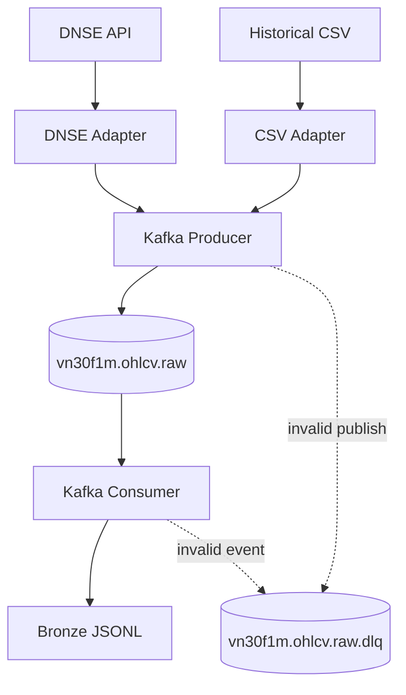
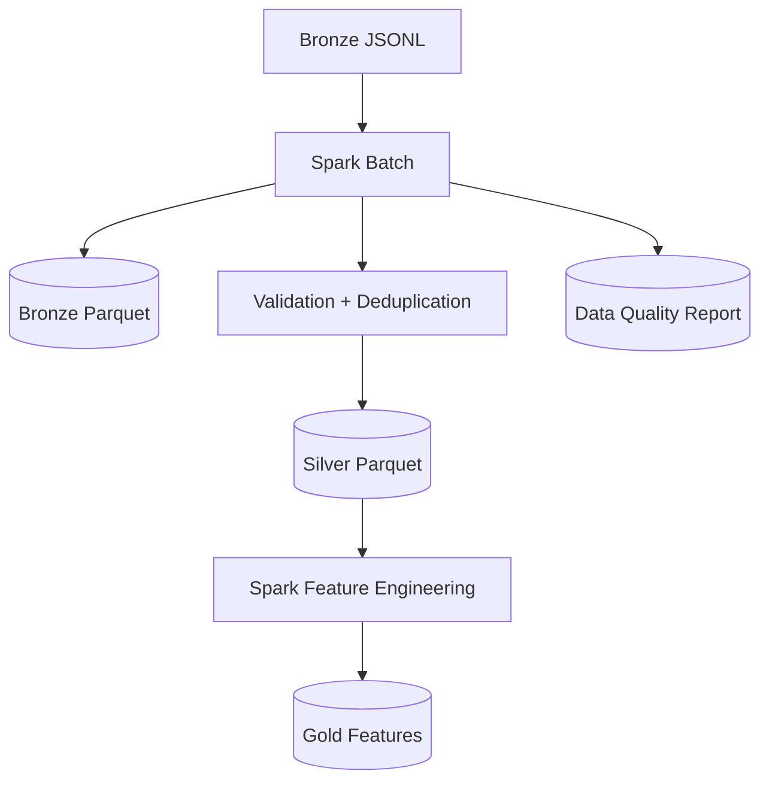
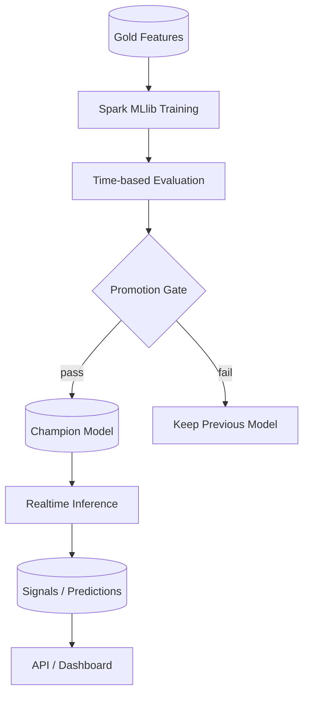

# VN30F1M Quant Platform

## 1. Mục tiêu

`VN30F1M Quant Platform` là nền tảng Big Data cho dữ liệu hợp đồng tương lai
VN30F1M. Nền tảng có nhiệm vụ:

1. Thu nhận dữ liệu lịch sử và dữ liệu mới từ DNSE.
2. Đưa mọi raw event qua Apache Kafka để replay, audit và tách producer khỏi
   downstream processing.
3. Dùng Apache Spark để chuẩn hóa, kiểm tra chất lượng và tạo các lớp dữ liệu
   Bronze/Silver/Gold.
4. Dùng Spark MLlib để train/evaluate model trên dữ liệu lịch sử.
5. Cung cấp nền tảng cho realtime inference LONG/SHORT/HOLD sau khi model đã
   được train.

Dự án hiện tập trung vào data platform. Nó chưa tự động đặt lệnh và không phải
là hệ thống giao dịch production.

## 2. Nguyên tắc kiến trúc

- Kafka là event plane bắt buộc của MVP ingestion.
- Parquet local là storage mặc định; MinIO là backend object storage có thể
  thay thế mà không đổi data contract.
- Spark là compute engine chính cho batch và các bước Big Data.
- Spark MLlib là framework train model chính; thư viện khác chỉ dùng benchmark
  khi cần.
- Dữ liệu canonical dùng `snake_case`, `event_time` UTC và
  `trading_date` theo `Asia/Ho_Chi_Minh`.
- Business key của một bar là:

  ```text
  symbol + event_time + timeframe
  ```

- Mọi pipeline phải idempotent, có `run_id`, provenance và quality status.
- Raw input không bị sửa tại chỗ; Bronze/Silver/Gold có thể rebuild.
- Không forward-fill OHLCV qua khoảng nghỉ phiên.
- Không dùng dữ liệu tương lai trong feature, label, train hoặc inference.
- Mỗi boundary giữa service/layer phải có contract và test.

## 3. Tổng quan hệ thống

### 3.1 Ingestion và Kafka



### 3.2 Spark lakehouse



### 3.3 Training và realtime inference



### 3.4 Data plane

Data plane là dữ liệu lớn hoặc dữ liệu lâu dài:

- DNSE/CSV chứa dữ liệu nguồn.
- Kafka mang raw event nhỏ, có key và schema version.
- Parquet/MinIO chứa Bronze, Silver, Gold, reports và model artifacts.
- ClickHouse chỉ là serving/query layer tùy chọn; không phải source of truth.

### 3.5 Event plane

Apache Kafka mang các event OHLCV và sau này là signal/model events.

- `vn30f1m.ohlcv.raw`: raw OHLCV hợp lệ để downstream consume.
- `vn30f1m.ohlcv.raw.dlq`: event không hợp lệ hoặc không parse được.
- Message key: `symbol|event_time_utc|timeframe`.
- Kafka không chứa file dữ liệu lớn; file lớn phải nằm ở lakehouse và event
  chỉ tham chiếu đến object/path nếu cần.

### 3.6 Compute plane

- Python adapter: giao tiếp DNSE và chuẩn hóa nguồn.
- Spark batch: validation, deduplication, Bronze/Silver và quality report.
- Spark MLlib: feature pipeline, training và batch evaluation.
- Inference runtime: đọc model version đã được promote và tính prediction.

### 3.7 Serving plane

Serving plane chỉ đọc output đã được kiểm tra:

- Signal/prediction store.
- ClickHouse hoặc Parquet query.
- API.
- Dashboard.

Dashboard không được tự đọc raw CSV, tự gọi DNSE hoặc tự train model.

## 4. Thành phần và ownership

| Thành phần | Ownership | Input | Output | Trạng thái |
|---|---|---|---|---|
| `vn30f1m_core` | config, paths, CLI | env/args | runtime settings | Đã có |
| `vn30f1m_dataset` | CSV/DNSE adapter, canonical OHLCV | CSV/DNSE | raw DataFrame | Đã có |
| `vn30f1m_streaming` | Kafka producer/consumer | raw DataFrame/Kafka | raw topic, bronze JSONL, DLQ | Đã có |
| `vn30f1m_batch` | Spark Bronze/Silver batch | bronze JSONL | Parquet + report | Đã viết; cần PySpark runtime |
| `vn30f1m_analysis` | features, labels, strategy, backtest | Silver/Gold | features/signals/reports | Roadmap |
| `pipelines/batch_jobs` | orchestration của Spark jobs | configs/schedules | run outputs | Roadmap |
| `apps/futures_dashboard` | hiển thị metrics/signal | serving outputs | dashboard | Roadmap |
| Model registry | model version/champion/challenger | training artifacts | promoted model | Roadmap |

## 5. Data lifecycle

```text
SOURCE
  |
  v
KAFKA RAW EVENT
  |
  v
BRONZE JSONL / BRONZE PARQUET
  |
  +--> rejected / duplicate report
  |
  v
SILVER VALIDATED + DEDUPLICATED
  |
  v
GOLD FEATURES + LABELS
  |
  v
MODEL TRAINING / BACKTEST
  |
  v
PREDICTIONS / SIGNALS
  |
  v
API / DASHBOARD
```

### 5.1 Bronze

Bronze giữ raw event sau Kafka consumer, kể cả record bị reject để audit.
Bronze phải có tối thiểu:

- raw contract fields;
- Kafka key/partition/offset nếu có;
- `quality_status`;
- source và `ingest_run_id`;
- timestamp UTC.

### 5.2 Silver

Silver chỉ chứa record đạt validation:

- OHLC hợp lệ và dương;
- volume không âm;
- timestamp timezone-aware UTC;
- đúng `trading_date` local market;
- không trùng business key;
- đúng timeframe.

### 5.3 Gold

Gold chứa feature, label và output phân tích. Gold không được trộn raw event với
feature hoặc prediction trong cùng một contract.

## 6. Contract chính

### 6.1 OHLCV

Canonical timeframe của ML/backtest MVP là `15m`; source cadence ưu tiên `1m`.

Các cột bắt buộc:

```text
symbol, event_time, trading_date, timeframe,
open, high, low, close, volume,
source, source_record_id, ingest_run_id,
ingested_at, quality_status
```

Nguồn chuẩn chi tiết nằm tại [docs/DATA_CONTRACTS.md](docs/DATA_CONTRACTS.md).

### 6.2 Kafka event

```json
{
  "schema_version": "ohlcv_raw_v1",
  "symbol": "VN30F1M",
  "event_time": "2026-08-06T02:15:00Z",
  "trading_date": "2026-08-06",
  "timeframe": "1m",
  "open": 1234.5,
  "high": 1236.0,
  "low": 1234.0,
  "close": 1235.2,
  "volume": 1000.0,
  "source": "dnse_api",
  "source_record_id": "dnse:VN30F1M:2026-08-06T02:15:00Z",
  "ingest_run_id": "run-001",
  "published_at": "2026-08-06T02:16:00Z"
}
```

Schema version phải tăng khi thay đổi meaning hoặc kiểu dữ liệu. Record sai
contract không được âm thầm rơi khỏi hệ thống; phải được log/report hoặc đưa
vào DLQ.

## 7. Idempotency, checkpoint và recovery

Mỗi pipeline run có:

```text
run_id
input_root / input_snapshot
config snapshot
schema version
started_at
completed_at
status
quality report
```

Kafka consumer hiện dùng SQLite state để không ghi trùng business key khi
replay. Spark batch dùng `dedupe_rank` và chọn record mới nhất theo
`consumed_at`/Kafka offset.

Các phase tiếp theo phải bổ sung manifest/checkpoint bền vững cho Spark và
model pipeline. Không được đánh dấu run hoàn tất trước khi output và quality
report đã ghi thành công.

Failure policy:

- Producer lỗi: retry có giới hạn, không lặp vô hạn.
- Event lỗi schema: DLQ.
- Consumer crash: Kafka replay từ committed offset.
- Spark fail: giữ output run cũ, chạy run mới với `run_id` khác.
- Duplicate: bỏ qua ở Silver nhưng vẫn thống kê trong quality report.
- Model fail evaluation: giữ champion, không promote challenger.

## 8. ML và realtime prediction

Training và inference là hai workflow khác nhau:

```text
Silver 15m
   |
   v
Spark features + labels
   |
   v
Time-based split
   |
   v
Spark MLlib train/evaluate
   |
   v
Candidate model --> evaluation gate --> Champion model
                                      |
                                      v
                             realtime inference
```

Training không chạy ở mỗi tick. Model được train offline theo lịch hoặc khi
có đủ dữ liệu mới. Realtime inference chỉ load champion model, nhận bar/feature
mới và tạo:

```text
LONG | SHORT | HOLD
confidence
model_version
feature_set_version
available_at
```

Mọi prediction phải truy được về input event, feature version và model version.

## 9. Deployment local

MVP local dùng Docker Compose cho Kafka. Parquet nằm trong workspace; MinIO,
ClickHouse và dashboard có thể bật theo phase.

```text
Docker Compose Kafka
        |
Python CLI producer/consumer
        |
Spark local[*]
        |
Parquet local lakehouse
```

Production-like deployment sau này mới tách broker, object storage, serving,
metrics và orchestration thành service riêng.

## 10. Observability và security

Mỗi service nên phát hành:

- `/healthz` cho liveness;
- `/readyz` cho dependency readiness;
- metrics số record, latency, retry, reject, DLQ, duplicate;
- log structured có `run_id`, `symbol`, `timeframe` nhưng không chứa token.

Credential DNSE, Kafka SASL và object-store secret chỉ đọc từ environment/secret
manager. Không commit `.env`, API key, API secret hoặc model private artifact.

## 11. Cấu trúc repository mục tiêu

```text
vn30f1m_platform/
├── ARCH.MD
├── contracts/                 # schema/version cho event và dataset
├── docs/                      # contract, phase, runbook
├── infra/                     # Docker Compose và service config
├── packages/
│   ├── vn30f1m_core/          # config, paths, CLI
│   ├── vn30f1m_dataset/       # CSV/DNSE và canonical data
│   ├── vn30f1m_streaming/     # Kafka producer/consumer/DLQ
│   ├── vn30f1m_batch/         # Spark Bronze/Silver/report
│   └── vn30f1m_analysis/      # features, labels, backtest, ML
├── pipelines/
│   ├── streaming_jobs/        # long-running ingestion commands
│   └── batch_jobs/             # scheduled Spark jobs
├── lakehouse/
│   ├── landing/
│   ├── bronze/
│   ├── silver/
│   ├── gold/
│   └── reports/
├── models/                    # local ignored artifacts
└── tests/                     # unit, contract, integration, e2e
```

## 12. Ranh giới với Aurora Cosmic

VN30F1M học các pattern tốt từ Aurora Cosmic:

- tách data plane, event plane và compute plane;
- Bronze/Silver/Gold rõ ownership;
- contract versioning;
- checkpoint, manifest và idempotency;
- model registry và champion/challenger;
- health/metrics/test theo từng service.

VN30F1M không copy nguyên stack của Aurora:

- Kafka thay cho NATS vì Kafka là yêu cầu MVP của đồ án;
- Spark thay cho Rust preprocessing vì đây là đồ án Big Data;
- Spark MLlib thay cho GPU-only Python training;
- Python trước, chưa tách Go/Rust khi chưa có nhu cầu vận hành thực tế;
- chưa xóa raw data tự động vì cần audit và backtest lịch sử.

## 13. Trạng thái triển khai

- Phase 01–04: architecture, contracts, core config, historical loader và DNSE
  client đã có.
- Phase 05: Kafka Compose, raw topic, DLQ, producer và consumer đã có.
- Phase 05B: Spark batch code đã có; runtime cần cài PySpark và chạy trên Bronze
  input.
- Phase 06: feature engineering chưa triển khai.
- Phase 07: Spark MLlib training chưa triển khai.
- Realtime inference, API và dashboard là các phase sau.

ARCH.MD là tài liệu định hướng. Khi code và tài liệu lệch nhau, phải cập nhật
contract/architecture trước khi mở rộng pipeline.
