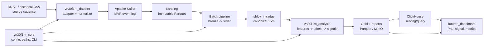

# Tổng quan kiến trúc VN30F1M

`vn30f1m_platform` phục vụ dữ liệu VN30F1M/futures intraday và được tách riêng khỏi dự án cổ phiếu ngân hàng.

## Quyết định kiến trúc của Phase 01

- **Timeframe phân tích/backtest MVP:** `15m`.
- **Cadence dữ liệu đầu vào:** giữ cadence gốc của nguồn, ưu tiên `1m`; không làm mất dữ liệu gốc khi resample.
- **Timeframe được phép:** `1m`, `5m`, `15m`, `30m`; chỉ `15m` là canonical cho ML/backtest MVP.
- **Execution mode MVP:** Kafka ingestion + batch rebuild cho ML/backtest.
- **Storage source of truth:** Parquet local hoặc MinIO; ClickHouse chỉ là serving/query layer.
- **Message broker MVP:** Apache Kafka nằm trong đường ingest bắt buộc.

## Sơ đồ tổng quan

## Luồng dữ liệu và ownership

| Thành phần | Đọc | Ghi | Trách nhiệm chính |
|---|---|---|---|
| `vn30f1m_dataset` | DNSE/API, CSV legacy | Kafka topic raw events | Chuẩn hóa tên cột, timezone, key và provenance |
| Apache Kafka | Raw OHLCV events | Topic replay/audit | Message broker bắt buộc trong MVP |
| `pipelines/batch_jobs` | Kafka/landing, `ohlcv_intraday` | `bronze`, `silver` | Kiểm tra chất lượng, sort, deduplicate, resample |
| `vn30f1m_analysis` | `silver`/canonical OHLCV | `gold`, labels, signals, reports | Feature, label, strategy và backtest |
| `vn30f1m_core` | Config và filesystem | Run metadata, logs | Điều phối, không sở hữu business data |
| `ClickHouse` | Gold/reports | Bảng serving | Query/dashboard; không phải source of truth |
| `futures_dashboard` | ClickHouse hoặc Parquet | Không ghi dữ liệu pipeline | Hiển thị và lọc kết quả |

## Ranh giới các layer

1. **Landing:** bản ghi sau adapter, giữ nguyên dữ liệu nguồn theo từng lần ingest; không overwrite im lặng.
2. **Bronze:** dữ liệu đã parse và gắn metadata ingest, vẫn gần với nguồn.
3. **Silver:** dữ liệu đã chuẩn hóa theo contract `ohlcv_intraday`, unique theo key và đạt quality checks.
4. **Gold:** features, labels, signals và kết quả phục vụ phân tích/backtest.
5. **Serving:** bản sao tối ưu truy vấn; có thể rebuild từ Parquet/MinIO.

## Quy tắc resample

- Resample theo `event_time` và theo từng `symbol`, không gộp qua ngày/phiên giao dịch.
- `open = first`, `high = max`, `low = min`, `close = last`, `volume = sum`.
- Chỉ tạo nến derived khi có bản ghi hợp lệ; không tự điền giá cho khoảng nghỉ phiên.
- Nến thiếu phải được đánh dấu trong quality report, không silently forward-fill OHLCV.
- `15m` là output chuẩn cho baseline `logistic_h4`; `5m` và `30m` chỉ là output nghiên cứu sau MVP.

## Nguyên tắc vận hành

- Mọi output phải truy ngược được về `ingest_run_id` và source.
- Batch phải idempotent theo business key và run/config version.
- Feature tại bar `t` chỉ được dùng cho quyết định từ bar kế tiếp; label là dữ liệu train/evaluate, không đi vào feature input.
- Không để dashboard phụ thuộc trực tiếp vào GCP hoặc DNSE live API.
- Code từ `Trading_system` chỉ là nguồn tham khảo migration; không mang theo production dependency cũ.
